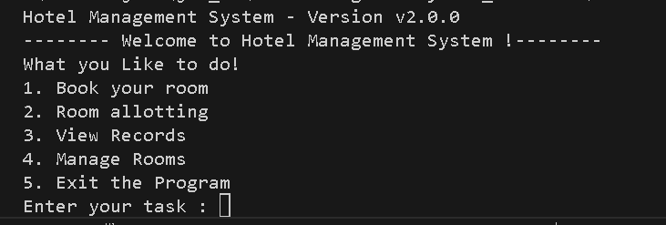

# hotelmanagement-system
This is program to manage the bookin system of hotel.
 
This program is a version 1 full released version of hotal management system.
 
# Features :  
1. Regestring guest
2. alloting room
3. add status of room allong with alloting.
4. view status of room.
5. Managing bookings

This ia a console based program but i will better try to make it work on GUI and it is also a file based program.  
It is best system for a low end usage.

<!--    -->

  
   
  <em>Figure 1: Room booking screen with input fields</em>

This is the output of the console based hotel management system now you can perform any task.
